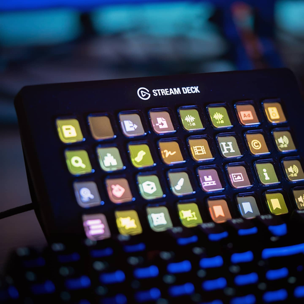

# Stream Awesome - Stream Deck Icon Generator using Font Awesome

### Demo available online: https://skate702.de/StreamAwesome/

Generate awesome looking stream deck icons like [these](https://www.instagram.com/p/CKPCM_YF16a/). Close to the [Elgato original](https://www.elgato.com/stream-deck) and of course awesome because of [Font Awesome](https://fontawesome.com/). Currently, in prototyping phase.

## How to install
1. Clone the repository
2. Download [Font Awesome for the web](https://fontawesome.com/download) 5.6.0 or higher
3. Extract the folder in `prototype` directory of cloned repository
4. Rename extracted folder to `fontawesome`
5. Localhost `./prototype`, e.g., using `npx http-server`
