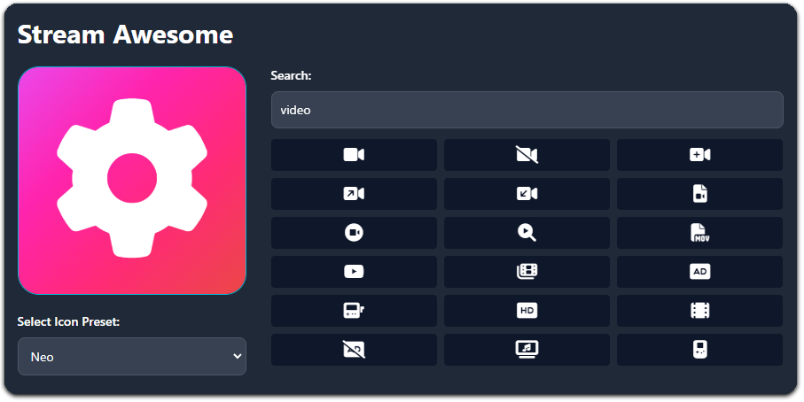

  <h3 align="center"> 
  <a href="https://streamawesome.app">🔗 Available Online</a></h3>

&nbsp;

## Stream Awesome - Stream Deck Icon Generator using Font Awesome

Generate awesome-looking Stream Deck icons. Close to the [Elgato original](https://www.elgato.com/stream-deck) and awesome because of [Font Awesome](https://fontawesome.com/).

## How to install
0. Precondition: Install [Node](https://nodejs.org) and npm
1. Clone this repository
2. Download a recent version of [Font Awesome For The Web](https://fontawesome.com/download)
3. Extract the folders `css` and `webfonts` into `StreamAwesome/fonts/fontawesome`
4. Run `npm install` from within the `StreamAwesome` folder to install all dependencies
5. Run `npm run dev` from within the `StreamAwesome` folder or use the provided Visual Studio Code config
6. Open the displayed localhost port in your web browser
